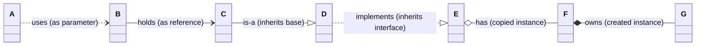
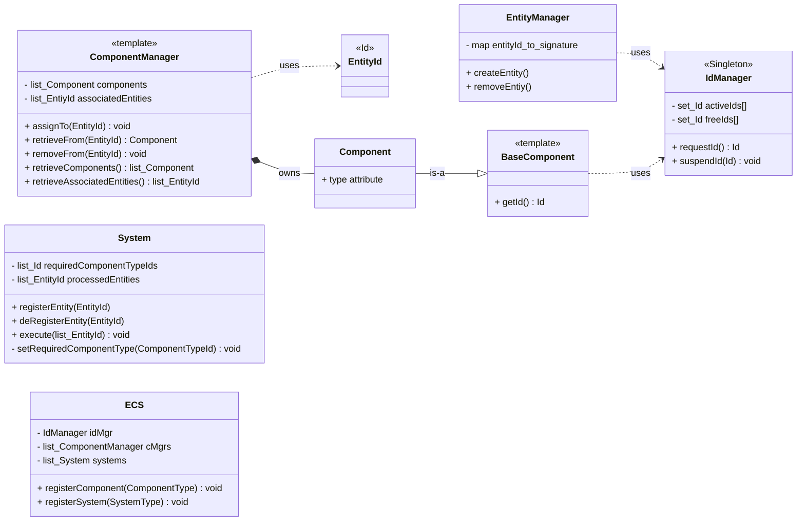

```mermaid
classDiagram
direction LR

A ..> B : uses (as parameter)
B --> C : holds (as reference)
C --|> D : is-a (inherits base)
D ..|> E : implements (inherits interface)
E o-- F : has (copied instance)
F *-- G : owns (created instance)
```

```mermaid
classDiagram 

direction LR
title ECS

class IdManager {
    <<Singleton>>
    - set_Id activeIds[]
    - set_Id freeIds[]
    + requestId() Id
    + suspendId(Id) void
}

class EntityId {
    <<Id>>
}

EntityManager ..> IdManager : uses
class EntityManager {
- map entityId_to_signature
+ createEntity()
+ removeEntiy()
}

BaseComponent ..> IdManager : uses
class BaseComponent {
    <<template>>
    + getId() Id
}

Component --|> BaseComponent : is-a
class Component {
    + type attribute
}

ComponentManager *-- Component : owns
ComponentManager ..> EntityId : uses
class ComponentManager {
    <<template>>
    - list_Component components
    - list_EntiyId associatedEntities
    + assignTo(EntityId) void
    + retrieveFrom(EntityId) Component
    + removeFrom(EntityId) void
    + retrieveComponents() list_Component
    + retrieveAssociatedEntities() list_EntityId
}

class System {
    - list_Id requiredComponentTypeIds
    - list_EntityId processedEntities
    + registerEntity(EntityId)
    + deRegisterEntity(EntityId)
    + execute(list_EntityId) void
    - setRequiredComponentType(ComponentTypeId) void
}

class ECS {
    - IdManager idMgr
    - list_ComponentManager cMgrs
    - list_System systems
    + registerComponent(ComponentType) void
    + registerSystem(SystemType) void
}
```
