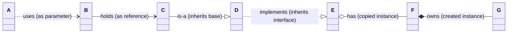
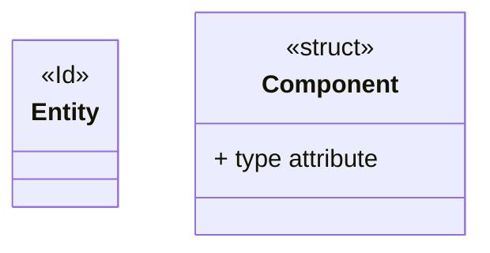

```mermaid
classDiagram
direction LR
A ..> B : uses (as parameter)
B --> C : holds (as reference)
C --|> D : is-a (inherits base)
D ..|> E : implements (inherits interface)
E o-- F : has (copied instance)
F *-- G : owns (created instance)
```

```mermaid
classDiagram 

direction TB
title ECS

class Entity {
    <<Id>>
}

class Component {
    <<struct>>
    + type attribute
}

```
