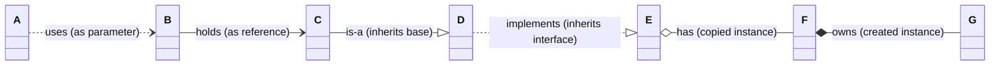
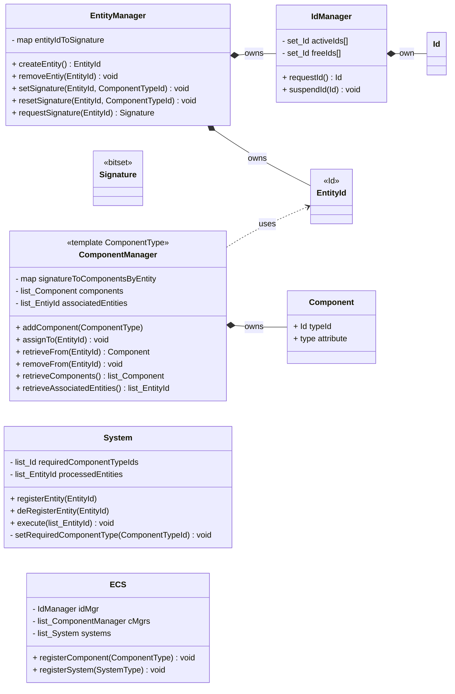

```mermaid
classDiagram
direction LR

A ..> B : uses (as parameter)
B --> C : holds (as reference)
C --|> D : is-a (inherits base)
D ..|> E : implements (inherits interface)
E o-- F : has (copied instance)
F *-- G : owns (created instance)
```

```mermaid
classDiagram 

direction LR
title ECS

class Id

IdManager *-- Id : own
class IdManager {
    - set_Id activeIds[]
    - set_Id freeIds[]
    + requestId() Id
    + suspendId(Id) void
}

class EntityId {
    <<Id>>
}

EntityManager *-- IdManager : owns
EntityManager *-- EntityId : owns
class EntityManager {
- map entityIdToSignature
+ createEntity() EntityId
+ removeEntiy(EntityId) void
+ setSignature(EntityId, ComponentTypeId) void
+ resetSignature(EntityId, ComponentTypeId) void
+ requestSignature(EntityId) Signature
}

class Component {
    + Id typeId
    + type attribute
}

class Signature {
    <<bitset>>
}


class ComponentManager {
    <<template ComponentType>>
    - map signatureToComponentsByEntity    
    + addComponent(ComponentType)
}

ComponentManager *-- Component : owns
ComponentManager ..> EntityId : uses
class ComponentManager {
    <<template>>
    - list_Component components
    - list_EntiyId associatedEntities
    + assignTo(EntityId) void
    + retrieveFrom(EntityId) Component
    + removeFrom(EntityId) void
    + retrieveComponents() list_Component
    + retrieveAssociatedEntities() list_EntityId
}

class System {
    - list_Id requiredComponentTypeIds
    - list_EntityId processedEntities
    + registerEntity(EntityId)
    + deRegisterEntity(EntityId)
    + execute(list_EntityId) void
    - setRequiredComponentType(ComponentTypeId) void
}

class ECS {
    - IdManager idMgr
    - list_ComponentManager cMgrs
    - list_System systems
    + registerComponent(ComponentType) void
    + registerSystem(SystemType) void
}
```
