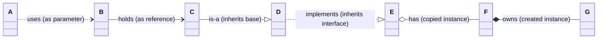
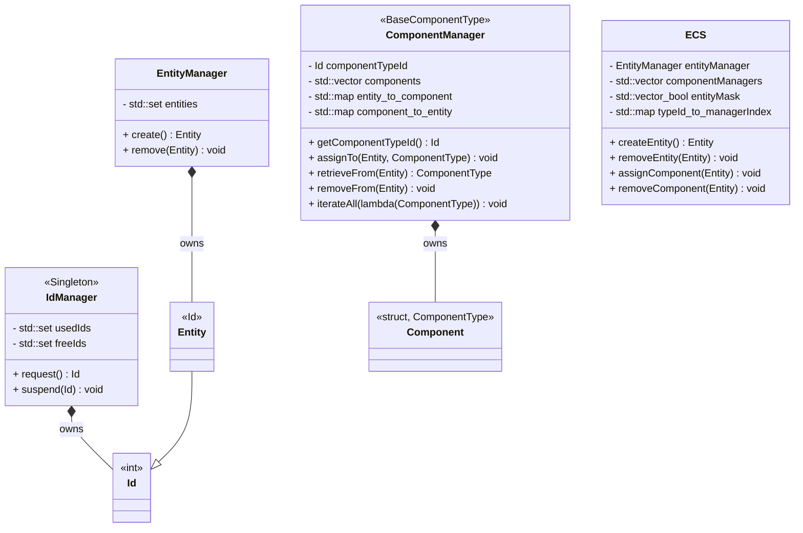

```mermaid
classDiagram
direction LR
A ..> B : uses (as parameter)
B --> C : holds (as reference)
C --|> D : is-a (inherits base)
D ..|> E : implements (inherits interface)
E o-- F : has (copied instance)
F *-- G : owns (created instance)
```

```mermaid
classDiagram 

direction TB
title ECS

    class Id {
        <<int>>
    }

    IdManager *-- Id : owns

    class IdManager {
        <<Singleton>>
        - std::set usedIds
        - std::set freeIds
        + request() Id
        + suspend(Id) void
    }

    Entity --|> Id

    class Entity {
        <<Id>>
    }

    EntityManager *-- Entity : owns

    class EntityManager {
        - std::set entities
        + create() Entity
        + remove(Entity) void
    }

    class Component {
        <<struct, ComponentType>>
    }

    ComponentManager *-- Component : owns

    class ComponentManager {
        <<BaseComponentType>>
        - Id componentTypeId
        - std::vector components
        - std::map entity_to_component
        - std::map component_to_entity
        + getComponentTypeId() Id
        + assignTo(Entity, ComponentType) void
        + retrieveFrom(Entity) ComponentType
        + removeFrom(Entity) void
        + iterateAll(lambda(ComponentType)) void
    }

    class ECS {
        - EntityManager entityManager
        - std::vector componentManagers
        - std::vector_bool entityMask
        - std::map typeId_to_managerIndex
        + createEntity() Entity
        + removeEntity(Entity) void
        + assignComponent(Entity) void
        + removeComponent(Entity) void
    }
```
