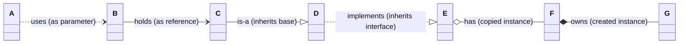
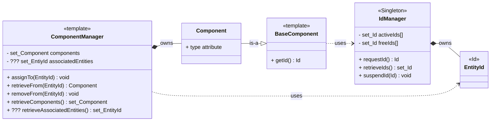

```mermaid
classDiagram
direction LR

A ..> B : uses (as parameter)
B --> C : holds (as reference)
C --|> D : is-a (inherits base)
D ..|> E : implements (inherits interface)
E o-- F : has (copied instance)
F *-- G : owns (created instance)
```

```mermaid
classDiagram 

direction LR
title ECS

class EntityId {
    <<Id>>
}

IdManager *-- EntityId : owns
class IdManager {
    <<Singleton>>
    - set_Id activeIds[]
    - set_Id freeIds[]
    + requestId() Id
    + retrieveIds() set_Id
    + suspendId(Id) void
}

BaseComponent ..> IdManager : uses
class BaseComponent {
    <<template>>
    + getId() Id
}

Component --|> BaseComponent : is-a
class Component {
    + type attribute
}

ComponentManager *-- Component : owns
ComponentManager ..> EntityId : uses
class ComponentManager {
    <<template>>
    - set_Component components
    - ??? set_EntiyId associatedEntities
    + assignTo(EntityId) void
    + retrieveFrom(EntityId) Component
    + removeFrom(EntityId) void
    + retrieveComponents() set_Component
    + ??? retrieveAssociatedEntities() set_EntityId
}

```
