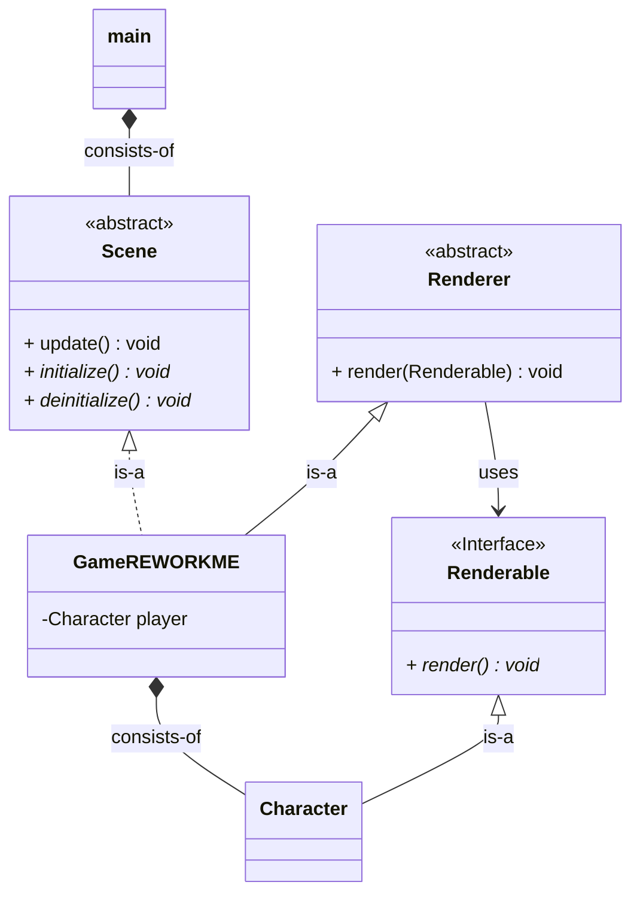

# ROGUELIKE
development of a (maybe) roguelike game with c++ and raylib

# REQUIREMENTS
- raylib
- emscripten

# TODOs
# Current
[0] rework current scene to non-singleton
[1] render function arguments
[2] player (controlable unit) at runtime
[3] units are globals -> move
[4] split globals and settings

# Shortterm
[0] plan struchture with UML
[0] implement environment

# Longterm 
[0] compile for linux & windows !

# Notes

## UML

# Done
[x] Render unit
