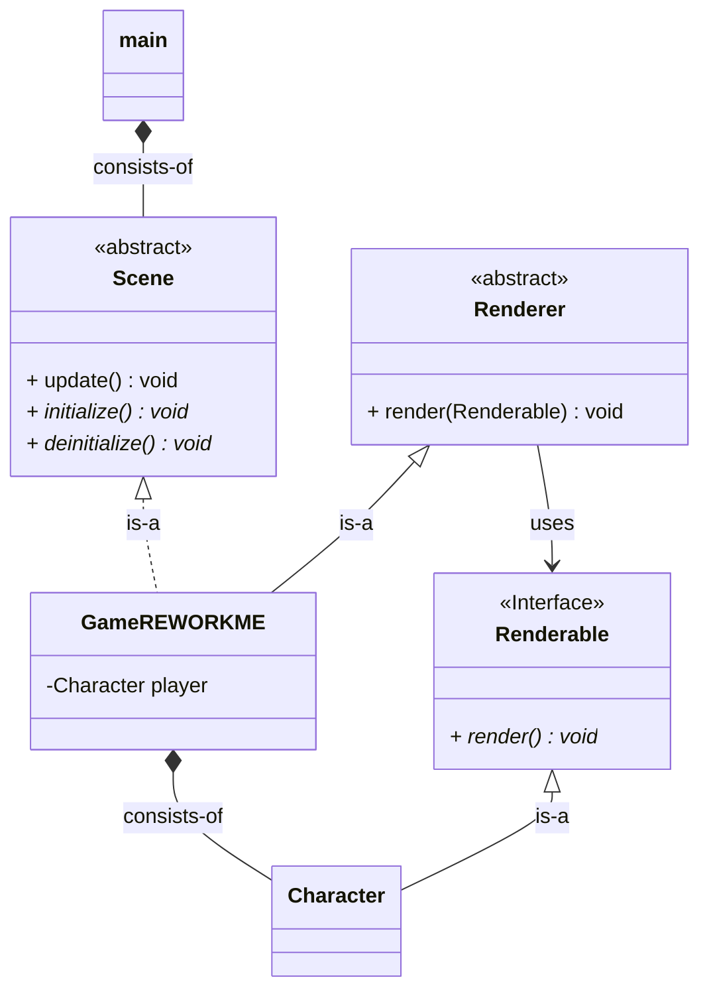

# ROGUELIKE
development of a (maybe) roguelike game with c++ and raylib

# REQUIREMENTS
- raylib
- emscripten

# TODOs
# Current
[0] compile for linux & windows !

# Shortterm
[0] plan struchture with UML

# Longterm 
[0] implement environment

# Notes

## UML

# Done
[x] Render unit
