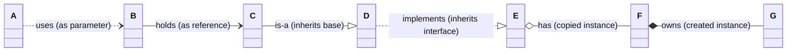
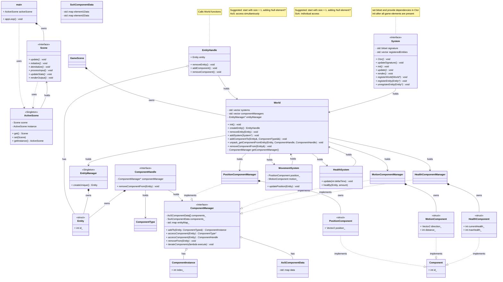

```mermaid
classDiagram
direction LR
A ..> B : uses (as parameter)
B --> C : holds (as reference)
C --|> D : is-a (inherits base)
D ..|> E : implements (inherits interface)
E o-- F : has (copied instance)
F *-- G : owns (created instance)
```

```mermaid
classDiagram 
direction TB
    class main {
        + ActiveScene activeScene
        + appLoop() void
    }
    main *-- Scene : owns
    main ..> ActiveScene : uses

    class Scene {
        <<Interface>>
        + update()* void
        + initialize()* void
        + deinitialize()* void
        + processInput()* void
        + updateState()* void
        + renderOutput()* void
    }
    Scene ..> ActiveScene : uses

    class ActiveScene {
        <<Singleton>>
        - Scene scene
        - ActiveScene instance
        + get() Scene
        + set(Scene)
        + getInstance() ActiveScene
    }
    ActiveScene --> Scene : holds

    class GameScene {
    }
    GameScene *-- World : owns

    class World {
        + init() void
        + createEntity() EntityHandle
        + removeEntity(Entity) void
        + addSystem(System*) void
        + addComponentTo(Entity&, ComponentType&&) void
        + unpack_getComponentFromEntity(Entity, ComponentHandle<ComponentType>, ComponentHandle<Args>) void
        + removeComponentFrom(Entity&) void
        - std::vector<System*> systems
        - std::vector<ComponentManager*> componentManagers
        - EntityManager* entityManager
        - ComponentManager<ComponentType> getComponentManager<ComponentType>()
    }
    World --> EntityManager : holds
    World --> PositionComponentManager : holds
    World --> MotionComponentManager : holds
    World --> HealthComponentManager : holds
    World --> MovementSystem : holds
    World --> HealthSystem : holds

    class EntityHandle {
        + removeEntity() void
        + addComponent() void
        + removeComponent() void
        + Entity entity
    }
    note for EntityHandle "Calls World functions"
    EntityHandle --> World : holds
    EntityHandle o-- Entity : has

    class EntityManager {
        <<Singleton>>
        + createUnique() Entity
    }
    EntityManager *-- Entity : owns

    class Entity {
        <<struct>>
        + int id_
    }

    class ComponentHandle {
        <<Interface>>
        + removeComponentFrom(Entity) void
        - ComponentManager<ComponentType>* componentManager
    }
    ComponentHandle *-- Entity : owns
    ComponentHandle --> ComponentType : holds
    ComponentHandle --> ComponentManager : holds

    class ComponentManager {
        <<Interface>>
        + addTo(Entity, ComponentType&)* ComponentInstance
        + accessComponent(Entity)* ComponentType*
        + accessComponent(Entity)* ComponentHandle<ComponentType>
        + removeFrom(Entity)* void
        + iterateComponents(lambda execute)* void
        - AoSComponentData[] components_
        - SoAComponentData components_
        - std::map<Entity, ComponentInstance> entityMap_
    }
    ComponentManager o-- ComponentInstance : has
    ComponentManager o-- AoSComponentData : has

    class ComponentInstance {
        + int index_
    }

    class AoSComponentData {
        - std::map<index, ComponentType> data
    }
    note for ComponentData "Suggested: start with size = 1, adding Null element?<br>AoS: access simultaniously"

    class SoAComponentData {
        - std::map<index, ComponentTypeElement1> element1Data
        - std::map<index, ComponentTypeElement2> element2Data
    }
    note for ComponentData "Suggested: start with size = 1, adding Null element?<br>SoA: individual access"

    class PositionComponentManager
    PositionComponentManager ..|> ComponentManager : implements
    PositionComponentManager *-- PositionComponent : owns

    class Component {
        + int id_
    }

    class PositionComponent {
        <<struct>>
        + Vector2 position_
    }
    PositionComponent ..|> Component : implements

    class MotionComponentManager
    MotionComponentManager ..|> ComponentManager : implements
    MotionComponentManager *-- MotionComponent : owns

    class MotionComponent {
        <<struct>>
        + Vector2 direction_
        + int distance_
    }
    MotionComponent ..|> Component : implements

    class HealthComponentManager
    HealthComponentManager ..|> ComponentManager : implements
    HealthComponentManager *-- HealthComponent : owns

    class HealthComponent {
        <<struct>>
        + int currentHealth_
        + int maxHealth_
    }
    HealthComponent ..|> Component : implements

    class System {
        <<Interface>>
        + Ctor()* void
        + updateSignature() void
        + init()* void
        + update()* void
        + render()* void
        + registerWorld(World*)* void
        + registerEntity(Entity*)* void
        + unregisterEntity(Entity*)* void
        - std::bitset<AMOUNT_COMPONENTS> signature
        - std::vector<Entity> registeredEntities
    }
    note for System "set bitset and provide dependencies in Ctor<br>init after all game elements are present"
    System --> World : holds

    class MovementSystem {
        + updatePosition(Entity) void
        - PositionComponent position_
        - MotionComponent motion_
    }
    MovementSystem --> World : holds

    class HealthSystem {
        + update(int deltaTime) void
        + healBy(Entity, amount)
    }
    HealthSystem --> World : holds
```
