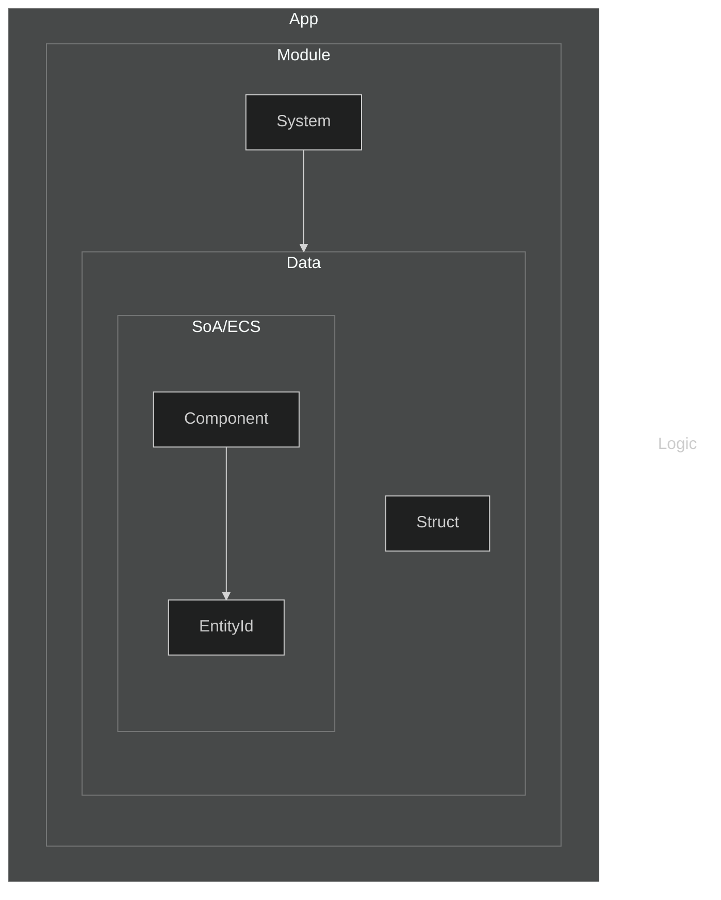
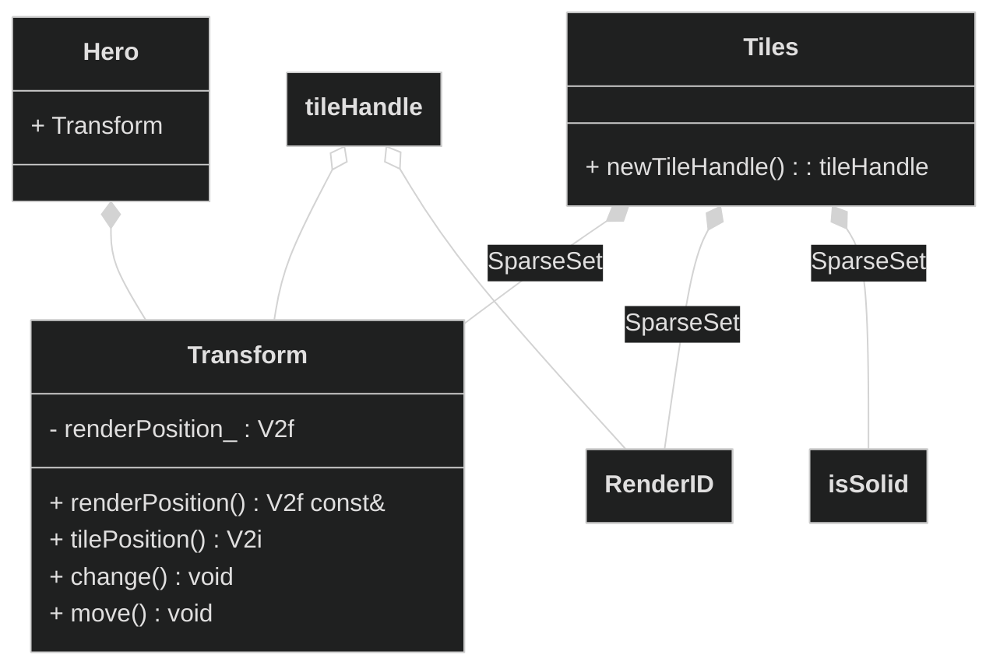

```mermaid
%%{
    init: {
        'theme': 'dark',
        'class': {
            'hideEmptyMembersBox': true
        }
    }
}%%
classDiagram
direction LR

A ..> B : uses member (as param, loose cpl)
B --> C : uses object (as param, strong cpl)
C --|> D : extends (inherits base)
D ..|> E : implements (realizes interface)
E o-- F : has (refernces instance)
F *-- G : owns (created instance)
```

```mermaid
%%{
    init: {
        'theme': 'dark'
    }
}%%
flowchart
Logic@{shape: text} 
direction TB
subgraph App
    subgraph Module
        subgraph Data
            subgraph SoA/ECS
                Component --> EntityId
            end
            Struct
        end
        System --> Data
    end
end
```

```mermaid
%%{
    init: {
        'theme': 'dark',
        'class': {
            'hideEmptyMembersBox': true
        }
    }
}%%
classDiagram
direction TB

class Transform {
    - renderPosition_ : V2f

    + renderPosition() V2f const&
    + tilePosition() V2i
    + change() void
    + move() void
}


Tiles *-- Transform : SparseSet
Tiles *-- RenderID : SparseSet
Tiles *-- isSolid : SparseSet
class Tiles {
    + newTileHandle() : tileHandle
}


tileHandle o-- Transform
tileHandle o-- RenderID
tileHandle 


class Hero {
    + Transform
}

Hero *-- Transform
```
