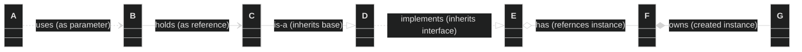

```mermaid
%%{init: {'theme': 'dark'}}%%
classDiagram
direction LR

A ..> B : uses (as parameter)
B --> C : holds (as reference)
C --|> D : is-a (inherits base)
D ..|> E : implements (inherits interface)
E o-- F : has (refernces instance)
F *-- G : owns (created instance)
```

```mermaid
%%{init: {'theme': 'dark'}}%%
classDiagram
direction TB

class Class {
}

