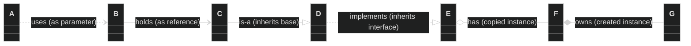
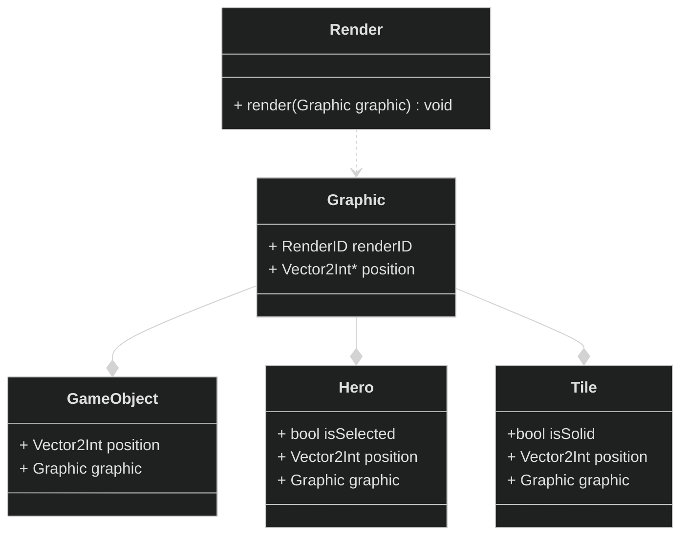

```mermaid
%%{init: {'theme': 'dark'}}%%
classDiagram
direction LR

A ..> B : uses (as parameter)
B --> C : holds (as reference)
C --|> D : is-a (inherits base)
D ..|> E : implements (inherits interface)
E o-- F : has (copied instance)
F *-- G : owns (created instance)
```

```mermaid
%%{init: {'theme': 'dark'}}%%
classDiagram
direction TB

class Graphic {
    + RenderID renderID
    + Vector2Int* position
}

class GameObject{
    + Vector2Int position
    + Graphic graphic
}
Graphic --* GameObject

class Hero {
    + bool isSelected
    + Vector2Int position
    + Graphic graphic
}
Graphic --* Hero

class Tile{
    +bool isSolid
    + Vector2Int position
    + Graphic graphic
}
Graphic --* Tile

class Render{
    + render(Graphic graphic) void
}
Render ..> Graphic

```

