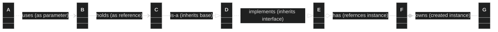

```mermaid
%%{init: {'theme': 'dark'}}%%
classDiagram
direction TB

class App {
    - AppConfig config_
    - Image const favicon_
    - int const fpsTarget_
    - SceneMain SceneMain_
    - snx::IScene* activeScene_
}

App *-- SceneMain

class SceneMain {
    - Game game_
    - Panels panels_
    - GameCamera gameCamera_
    - RenderData renderData_
    - Cursor cursor_
    - snx::DenseMap<Vector2I, Chunk> chunks_
    - snx::DenseMap<Vector2I, Fog> fogs_
}

SceneMain *-- Game

class Game {
    - UserInput userInput_
    - bool actionsInProgress_
    - int turn_
    + World world
    + Hero hero
}

Game *-- UserInput

struct UserInput {
    - InputActionID inputAction_
    - bool modifier_
    - std::unordered_map<int, InputActionID> keyToInputActionID_
    - std::unordered_map<int, InputActionID> mouseButtonToInputActionID_
    - std::unordered_map<InputActionID, int> inputActionIDToModifierKey_
    - int currentKey_
    - int lastKey_
    - int currentGesture_
    - int lastGesture_
    - double touchDownTime_
    - double touchUpTime_
    - double touchHoldDuration_
    - double lastTap_
}

Game *-- World 

class World {
    - std::vector<Map> maps_
    - int maxMapLevel_
    + int currentMapLevel
    + Map* currentMap
}

World *-- Map : Array

class Map {
    + Tiles tiles
    + Objects objects
    + Enemies enemies
}

Map *-- Tiles : SoA

class Tiles {
    - RectangleExI mapSize_
    + snx::DenseMap<Vector2I, PositionComponent> positions
    + snx::DenseMap<Vector2I, RenderID> renderIDs
    + snx::DenseMap<Vector2I, VisibilityID> visibilityIDs
    + std::unordered_set<Vector2I> isSolids
    + std::unordered_set<Vector2I> isOpaques
}

Tiles *-- PositionComponent

struct PositionComponent {
    - Vector2 position_
}

Map *-- Objects : SoA

class Objects {
    + snx::DenseMap<Vector2I, PositionComponent> positions
    + snx::DenseMap<Vector2I, RenderID> renderIDs
    + snx::DenseMap<Vector2I, std::string> names
    + snx::DenseMap<Vector2I, std::string> actions
    + snx::DenseMap<Vector2I, EventId> events
}

Objects *-- PositionComponent

Map *-- Enemies

class Enemies {
    + snx::DenseMap<Vector2I, size_t> ids
    + snx::DenseMap<size_t, AIComponent> ais
    + snx::DenseMap<size_t, PositionComponent> positions
    + snx::DenseMap<size_t, RenderID> renderIDs
    + snx::DenseMap<size_t, MovementComponent> movements
    + snx::DenseMap<size_t, EnergyComponent> energies
    + snx::DenseMap<size_t, HealthComponent> healths
    + snx::DenseMap<size_t, DamageComponent> damages
    - snx::IdManager idManager_
}

Enemies *-- AIComponent

class AIComponent {
    - int scanRange_
}

Enemies *-- PositionComponent

Enemies *-- MovementComponent

class MovementComponent {
    - std::vector<Vector2I> path_
    - Vector2I direction_
    - Vector2 currentVelocity_
    - int speed_
    - float cumulativeDistanceMoved_
    - bool isTriggered_
    - bool isInProgress_
}

Enemies *-- EnergyComponent

struct EnergyComponent {
    - int maxEnergy_
    - int currentEnergy_
    - bool isReady_
    + int regenRate
}

Enemies *-- HealthComponent

class HealthComponent {
    - int maxHealth
    - int currentHealth
    - int regenRate
}

Enemies *-- DamageComponent

struct DamageComponent {
    - int baseDamage_
    - int criticalHitChance_
    - int criticalHitDamage_
}

Game *-- Hero

class Hero {
    RenderID renderID
    MovementComponent movement
    EnergyComponent energy
    PositionComponent position
    HealthComponent health
    DamageComponent damage
    int visionRange
}

Hero *-- MovementComponent

Hero *-- EnergyComponent

Hero *-- PositionComponent

Hero *-- HealthComponent

Hero *-- DamageComponent

SceneMain *-- Panels

class Panels {
    + RectangleEx tileInfo
    + RectangleEx heroInfo
    + RectangleEx status
    + RectangleEx log
    + RectangleEx map
}

SceneMain *-- GameCamera

class GameCamera {
    - Camera2D camera_
    - RectangleEx const* viewport_
}

SceneMain *-- RenderData

class RenderData {
    + Textures textures
    + size_t theme
}

SceneMain *-- Cursor

class Cursor {
    + PositionComponent position
    + RenderID renderID
    + bool isActive
}

Cursor *-- PositionComponent

SceneMain *-- Chunk

class Chunk {
    + RectangleExI corners
    + PositionComponent position
    + RenderTexture renderTexture
}

Chunk *-- PositionComponent

SceneMain *-- Fog

class Fog {
    + Vector2I tilePosition
    + bool isFogOpaque
}
