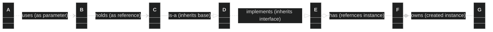
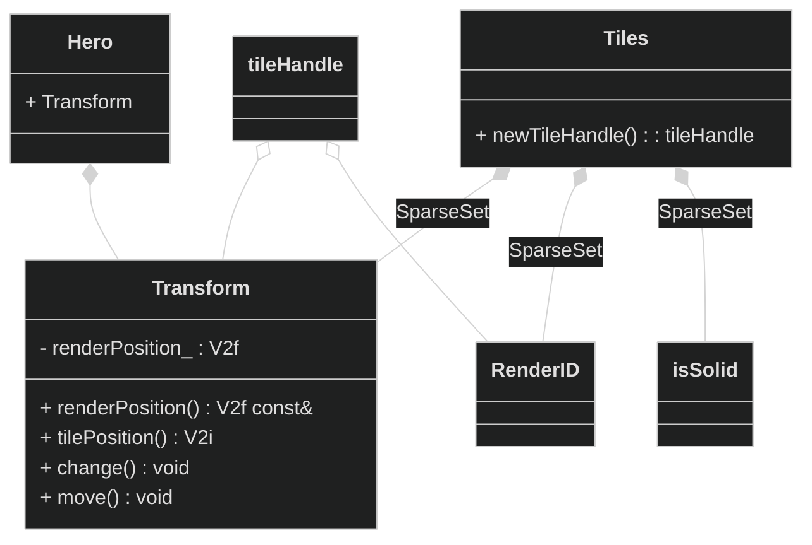

```mermaid
%%{init: {'theme': 'dark'}}%%
classDiagram
direction LR

A ..> B : uses (as parameter)
B --> C : holds (as reference)
C --|> D : is-a (inherits base)
D ..|> E : implements (inherits interface)
E o-- F : has (refernces instance)
F *-- G : owns (created instance)
```

```mermaid
%%{init: {'theme': 'dark'}}%%
classDiagram
direction TB

class Transform {
    - renderPosition_ : V2f

    + renderPosition() V2f const&
    + tilePosition() V2i
    + change() void
    + move() void
}


Tiles *-- Transform : SparseSet
Tiles *-- RenderID : SparseSet
Tiles *-- isSolid : SparseSet
class Tiles {
    + newTileHandle() : tileHandle
}


tileHandle o-- Transform
tileHandle o-- RenderID
tileHandle 


class Hero {
    + Transform
}

Hero *-- Transform
```
