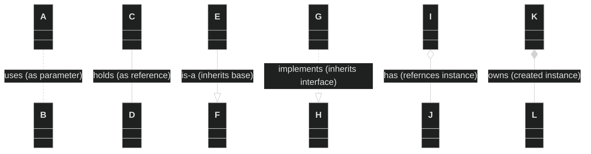
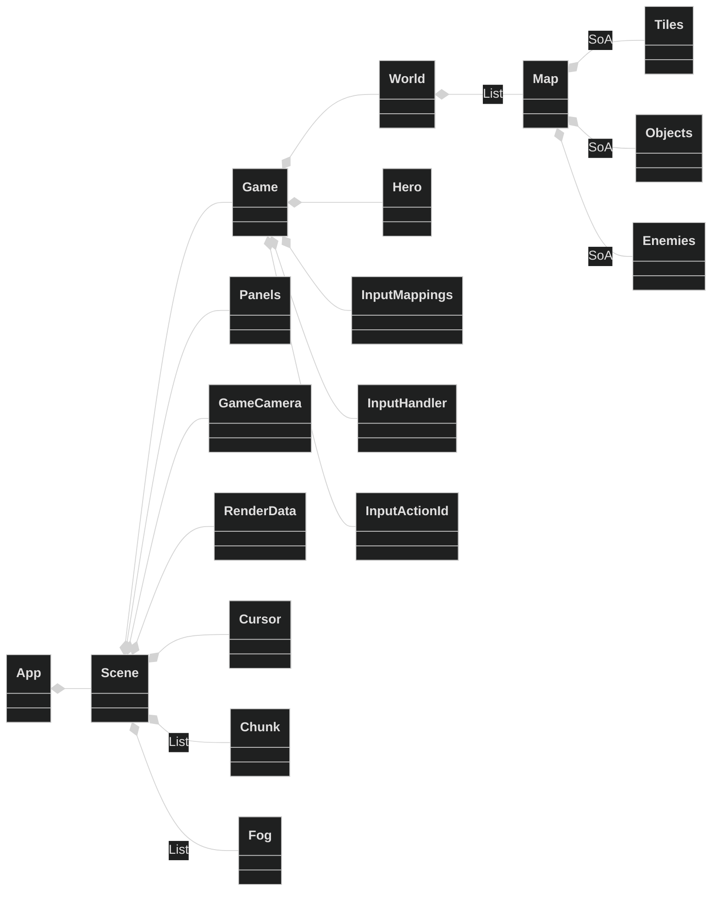
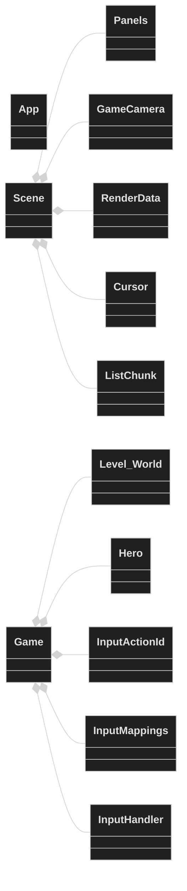

```mermaid
%%{init: {'theme': 'dark'}}%%
classDiagram
direction TD
    A ..  B : uses (as parameter)
    C --  D : holds (as reference)
    E --|> F : is-a (inherits base)
    G ..|> H : implements (inherits interface)
    I o-- J : has (refernces instance)
    K *-- L : owns (created instance)
```

# Old

```mermaid
%%{init: {'theme': 'dark'}}%%
classDiagram
direction LR

App *-- Scene
Scene *-- Game
Game *-- World
World *-- Map : List
Map *-- Tiles : SoA
Map *-- Objects : SoA
Map *-- Enemies : SoA
Game *-- Hero
Game *-- InputMappings
Game *-- InputHandler
Game *-- InputActionId
Scene *-- Panels
Scene *-- GameCamera
Scene *-- RenderData
Scene *-- Cursor
Scene *-- Chunk : List
Scene *-- Fog : List
```

# New

```mermaid
%%{init: {'theme': 'dark'}}%%
classDiagram
direction LR

class App
Scene *-- Panels
Scene *-- GameCamera
Scene *-- RenderData
Scene *-- Cursor
Scene *-- List Chunk 

Game *-- Level_World
Game *-- Hero
Game *-- InputActionId
Game *-- InputMappings
Game *-- InputHandler
```
