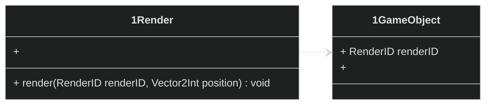

```mermaid
%%{init: {'theme': 'dark'}}%%
classDiagram
direction LR

%% A ..> B : uses (as parameter)
%% B --> C : holds (as reference)
%% C --|> D : is-a (inherits base)
%% D ..|> E : implements (inherits interface)
%% E o-- F : has (copied instance)
%% F *-- G : owns (created instance)        

class 1Render {
+ render(RenderID renderID, Vector2Int position) void
+ 
}

1Render ..> 1GameObject 
class 1GameObject{
+ RenderID renderID
+ 
}
```
