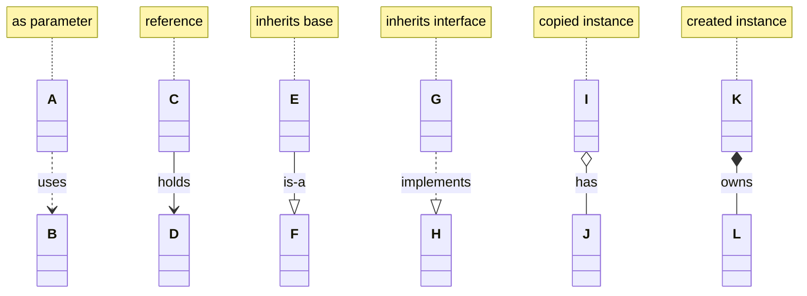
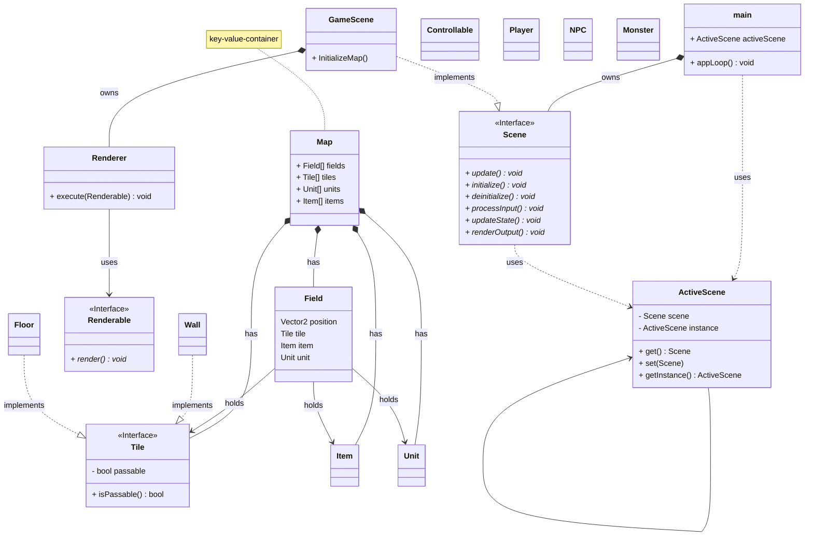

```mermaid
classDiagram 
A ..> B : uses
note for A "as parameter" 
C --> D : holds 
note for C "reference"
E --|> F : is-a 
note for E "inherits base"
G ..|> H : implements 
note for G "inherits interface"
I o-- J : has 
note for I "copied instance"
K *-- L : owns 
note for K "created instance"
```

```mermaid
classDiagram 
    class main {
        + ActiveScene activeScene
        + appLoop() void
    }
    main *-- Scene : owns
    main ..> ActiveScene : uses

    class Scene {
        <<Interface>>
        + update()* void
        + initialize()* void
        + deinitialize()* void
        + processInput()* void
        + updateState()* void
        + renderOutput()* void
    }
    Scene ..> ActiveScene : uses

    class ActiveScene {
        - Scene scene
        - ActiveScene instance
        + get() Scene
        + set(Scene)
        + getInstance() ActiveScene
    }
    ActiveScene --> ActiveScene

    class Renderer {
        + execute(Renderable) void
    }
    Renderer --> Renderable : uses


    class GameScene {
        + InitializeMap()
    }
    GameScene ..|> Scene : implements
    GameScene *-- Renderer : owns

    class Renderable{
        <<Interface>>
        + render()* void
    }

    class Map { 
        + Field[] fields
        + Tile[] tiles
        + Unit[] units
        + Item[] items
    }
    note for Map "key-value-container"
    Map *-- Field : has
    Map *-- Tile : has
    Map *-- Item : has
    Map *-- Unit : has

    class Field {
        Vector2 position
        Tile tile
        Item item
        Unit unit
    }
    Field --> Tile : holds
    Field --> Item : holds
    Field --> Unit : holds

    class Tile {
        <<Interface>>
        - bool passable
        + isPassable() bool
    }

    class Wall
    Wall ..|> Tile : implements
    
    class Floor 
    Floor ..|> Tile : implements


    class Unit 

    class Controllable 

    class Player 


    class NPC 
    
    class Monster 


    class Item 
```
